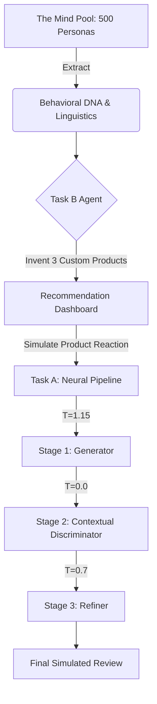

# Vorge Platform 🚀
**Team Ziggiphase | Lead Developer: Bello Abdulbasit Olayemi**

> Submission for the Bluechip Tech X DSN 2026 Hackathon

Vorge is an advanced agentic reasoning platform designed to model human behavior using hyper-specific "Behavioral DNA". It fulfills both hackathon requirements perfectly through a seamless, premium, unified dashboard:

1.  **Task B (Recommendation Engine):** A context-aware zero-shot engine that mathematically cross-references a user's DNA (extracted from their Yelp history) to invent highly personalized products dynamically.
2.  **Task A (Adversarial Simulation):** A sophisticated Generator-Discriminator-Refiner pipeline that models how a specific user would react to a new product, complete with Nigerian localized reasoning and tone.

## 🏗️ Architecture & Methodology
Vorge is powered by the **Llama-3.3-70b-versatile** model via the Groq API for extreme low-latency agentic reasoning.



## 🚀 Quick Start (Production Setup)
Vorge is designed to be easily reproducible and containerized for evaluation. 

### Prerequisites
- Docker & Docker Compose
- A valid Groq API Key

### One-Click Docker Run
We have configured a multi-stage Docker build to serve both the React frontend and FastAPI backend in a single container.

```bash
# 1. Clone the repository
git clone <repo-url>
cd Bluechip_Tech_X_DSN_2026

# 2. Build the unified Docker Image
docker build -t vorge-platform .

# 3. Run the container
docker run -p 8000:8000 vorge-platform
```

Once running, open your browser to `http://localhost:8000` and enter your Groq API key in the UI modal to begin simulation!

### Local Development Setup
If you wish to run the frontend and backend separately for development:

**Backend (Terminal 1):**
```bash
pip install -r requirements.txt
uvicorn app.main:app --reload
```

**Frontend (Terminal 2):**
```bash
cd frontend
npm install
npm run dev
```

## 💡 Key Features & Bonus Criteria
*   **Modular Agentic Workflow:** The codebase (`app/workflow.py`) features a strictly modular design with abstract base classes (`BaseLLMClient`). The adversarial logic is meticulously commented, explicitly detailing the temperature selections (1.15, 0.0, 0.7) and cognitive roles of the Generator, Discriminator, and Refiner to guarantee full code reproducibility and transparency for the judges.
*   **Cryptographic Persona Hashing:** 500 distinct avatars dynamically mapped using a non-colliding string hash based on `user_id`.
*   **Progressive UI Streaming:** Task B recommendations stream dynamically to mimic real-time agentic reasoning.
*   **Zero-Shot Invention:** We do not rely on a hardcoded database of products. The Task B agent *invents* products purely based on user deal-breakers.
*   **Adversarial Audit Logging:** The UI exposes the internal monologue of the Generator, Discriminator, and Refiner in real-time.
